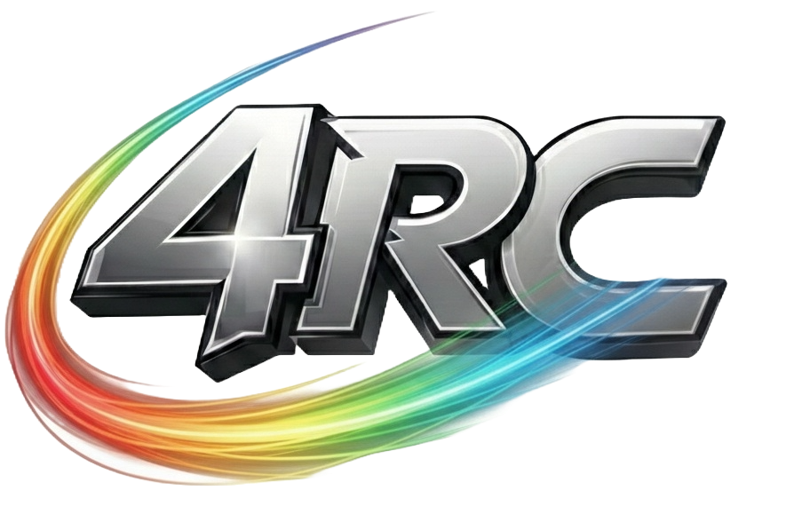
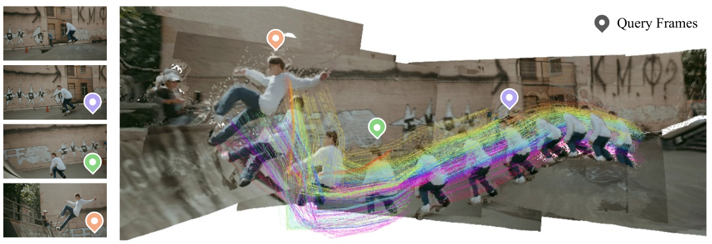
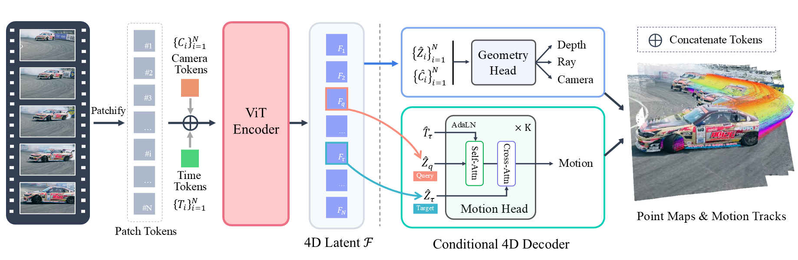

<div align="center">
<div style="text-align: center;">
    
    <h2>4RC: 4D Reconstruction via Conditional Querying Anytime and Anywhere</h2>
</div>

<div>
    <a href='https://scholar.google.com/citations?user=fZxK2B0AAAAJ&hl=en' target='_blank'>Yihang Luo</a><sup>1</sup>&emsp;
    <a href='https://shangchenzhou.com/' target='_blank'>Shangchen Zhou</a><sup>1</sup>&emsp;
    <a href="https://nirvanalan.github.io/" target='_blank'>Yushi Lan</a><sup>2</sup>&emsp;
    <a href="https://xingangpan.github.io/" target='_blank'>Xingang Pan</a><sup>1</sup>&emsp;
    <a href="https://www.mmlab-ntu.com/person/ccloy/" target='_blank'>Chen Change Loy</a><sup>1</sup>&emsp;
</div>
<div>
    <sup>1</sup>S-Lab, Nanyang Technological University&emsp; 
    <sup>2</sup>University of Oxford&emsp; 
</div>


<div>
    <h4 align="center">
        <a href="https://luo-yihang.github.io/projects/4RC/" target='_blank'>
        
        </a>
        <a href="http://arxiv.org/abs/2602.10094" target='_blank'>
        
        </a>
        
    </h4>
</div>

<strong>4RC <em>(pronounced "ARC")</em> enables unified and complete 4D reconstruction via conditional querying from monocular videos in a single feed-forward pass.</strong>

<div style="width: 100%; text-align: center; margin:auto;">
    
</div>

:sparkler: For more visual results, go checkout our <a href="https://yihangluo.com/projects/4RC/" target="_blank">project page</a>

---
</div>

<details>
<summary><b>Introducing 4RC</b></summary>
    <br>
    <div align="center">
        
        <p align="justify">
            We present 4RC, a unified feed-forward framework for 4D reconstruction from monocular videos. 
            Unlike existing methods that typically decouple motion from geometry or produce limited 4D attributes, 
            such as sparse trajectories or two-view scene flow, 4RC learns a holistic 4D representation that 
            jointly captures dense scene geometry and motion dynamics. At its core, 4RC introduces a novel 
            encode-once, query-anywhere and anytime paradigm: a transformer backbone encodes the entire video 
            into a compact spatio-temporal latent space, from which a conditional decoder can efficiently query 
            3D geometry and motion for any query frame at any target timestamp. To facilitate learning, we 
            represent per-view 4D attributes in a minimally factorized form, decomposing them into base 
            geometry and time-dependent relative motion. Extensive experiments demonstrate that 4RC outperforms 
            prior and concurrent methods across a wide range of 4D reconstruction tasks.
        </p>
    </div>
</details>

## 🔥 News
- [2026/02/11] Our paper is now live.


## 📝 Citation

   If you find our repo useful for your research, please consider citing our paper:

   ```bibtex
  @article{luo20264rc,
      title     = {4RC: 4D Reconstruction via Conditional Querying Anytime and Anywhere},
      author    = {Yihang Luo and Shangchen Zhou and Yushi Lan and Xingang Pan and Chen Change Loy},
      journal   = {arXiv preprint arXiv:2602.10094},
      year      = {2026}
  }
   ```

## 📫 Contact

If you have any questions, please feel free to reach us at `luo_yihang@outlook.com`.
